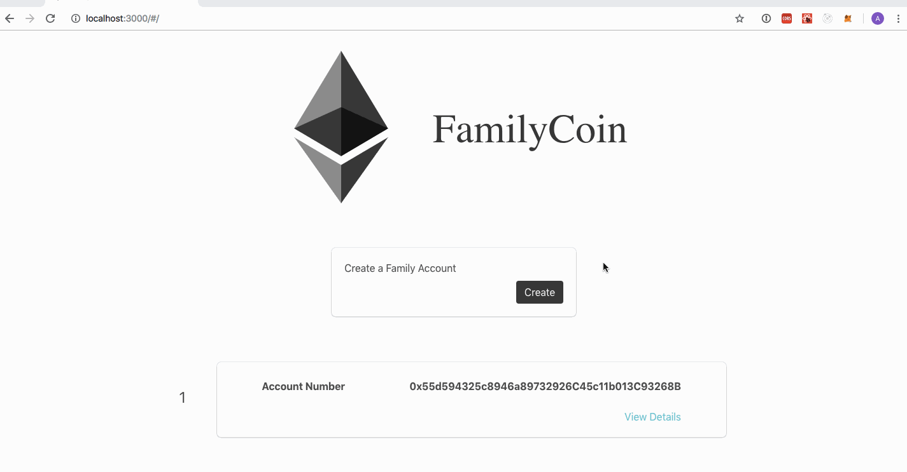
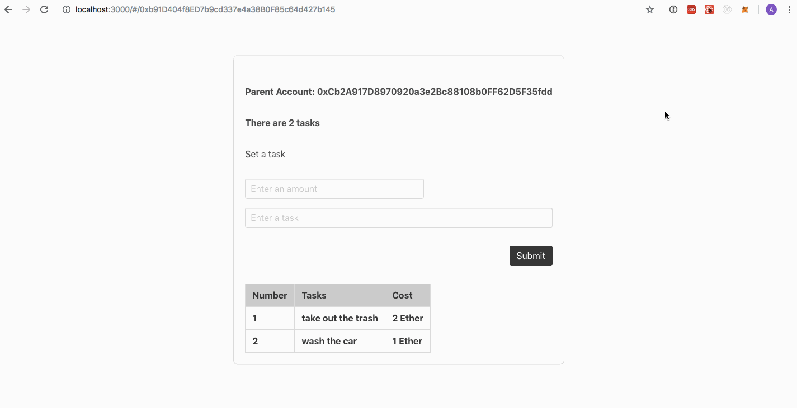

# FamilyCoin
FamilyCoin is a decentralized application build on the etheruem network. 

### Prerequisites
Metamask chrome extension is required.

https://chrome.google.com/webstore/detail/metamask/nkbihfbeogaeaoehlefnkodbefgpgknn

### Installation

```
npm install
npm start
```

### Screenshots


To create an account, press the create button. Next hit submit on metamask. Wait for confirmation from metamask. Once there is confirmation, refresh the page. 





Choose your account and press view details. Enter an amount, and a task. Press create, and hit submit on metamask. Once metamask confirms it, refresh the page 
